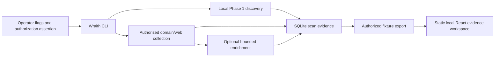

# Wraith Architecture Audit

**Audit status:** Local-first CLI architecture through R20 on feature branches. This document distinguishes implemented boundary contracts—including read-only deterministic reporting, comparison, policy control, and governance—from later proposed hosted, scheduled, and remote subsystems.

## Executive architecture summary

Wraith is currently a **local-first Go CLI with an embedded SQLite scan ledger, R1 policy package, R2 canonical web-evidence package, R3 policy-aware HTTP(S) transport, and static React fixture viewer**. Its direction is a modular, scriptable Web and API security toolkit—not a hosted multi-user product. R1 supplies a non-networking, fail-closed policy decision boundary; R2 supplies canonical asset and append-only evidence records; R3 moves Phase 2–3 target-web collectors through the evaluated transport. A REST API, enterprise tenancy/RBAC, scheduler, queue, worker fleet, remote dashboard backend, PostgreSQL, Redis, cloud control plane, and AI subsystem remain out of scope.

| Layer | Current implementation | Important boundary |
| --- | --- | --- |
| CLI | Includes `identity`, `auth-test`, and `compare` in `internal/cli`. | R10 credential testing requires `--authorized` and `--attack-auth`; live requests use R3. |
| Policy | `internal/policy` evaluates immutable project scope versions with target normalization, allow/deny rules, expiry/revocation, and decision traces. | The evaluator has no network I/O; R3 invokes it for every migrated HTTP target and resolved connection address. |
| Evidence | `internal/evidence` canonicalizes URLs and models project-local assets, endpoints, parameters, and typed immutable observations. | R3 emits redacted HTTP metadata only after centralized egress validation. |
| HTTP transport | `internal/httpengine` provides project-scoped HTTP(S), manual redirects, resolver pinning, destination safety, bounded reads, local pacing/concurrency, retries, explicit proxying, and reusable connections. | Target-web collectors must use this boundary; provider APIs and subprocesses remain explicit exceptions pending their own designs. |
| Web crawler | `internal/crawler` provides bounded canonical URL discovery, HTML resource/form extraction, robots/sitemap/security.txt discovery, and R2 persistence. | Every fetch uses R3; same-origin filtering is an optimization while R1 remains the authorization boundary. |
| Endpoint intelligence | `internal/endpointintelligence` creates a deterministic inventory from project-scoped R2 endpoints, parameters, and assets, with optional local OpenAPI/Swagger JSON parsing. | Passive only: no HTTP client, resolver, socket, JavaScript runtime, API execution, or new identity system. |
| JavaScript intelligence | `internal/jsanalysis` adds a parser-backed, static-only projection over explicit local JS/source-map files and selected R2 JavaScript assets. | No runtime, browser, subprocess, download, socket, DNS, or HTTP path; it reuses R2/R5 identities and appends bounded client-side metadata only. |
| Controlled fuzzing | `internal/fuzzing` creates deterministic, generic, explicit-parameter mutation plans, bounded local jobs, response metadata, and redacted R2 fuzz observations. | It has no transport of its own: non-dry-run work reaches the network only through R3 and therefore R1 authorization, destination safety, and redirect validation. It creates observations, not findings. |
| Bounded content discovery | `internal/contentdiscovery` provides R7.5 local-wordlist path and virtual-host plans, soft-404 fingerprints, non-crawling depth-capped path expansion, and redacted R2 content observations. | Requests use R3 only. The R3 Host override is hostname-validated and separately authorized through R1 before DNS or connection; no candidate DNS, alternate client, or crawler behavior exists. |
| Security validation | `internal/validation` provides deterministic passive checks over one selected endpoint response and redacted lifecycle-ready validation observations. | The `validate` CLI makes at most one bounded R3 request after project-local endpoint selection; validators create observed evidence only and exclude payloads, authentication attacks, credentials, destructive testing, and exploit claims. |
| Vulnerability intelligence | `internal/intelligence` builds deterministic project-local asset/endpoint graphs, correlates evidence-backed candidates, explains bounded confidence, and detects local snapshot changes. | It has no network path and uses only existing project-scoped evidence identities. SQLite stores compatible graph/correlation structures; no Neo4j, remote advisory feed, unqualified severity, or exploitability claim is introduced. |
| Authenticated security | `internal/authsecurity` provides bounded plans, in-memory local credential input, response analysis, and protection stops. | No secrets persist; lockout, MFA, CAPTCHA, rate limit, cancellation, budgets, and instability stop safely. |
| Pentest orchestration | `internal/pentest` and `wraith pentest` coordinate selected R1–R10 modules through deterministic plans, lifecycle events, project-scoped runs, bounded shared resources, fail-closed resume, and local reports. | The orchestrator introduces no alternate network client or security logic: live adapters reuse approved components; `auth_attack` remains gated by explicit `--attack-auth` and is never replayed by resume. |
| Request mutation planning | `internal/requestmutation` creates immutable, bounded request variants for existing R2 endpoint and parameter identities. | R11.1 has no HTTP, DNS, socket, subprocess, policy-evaluation, persistence, or execution path; a future approved executor must independently enforce R1 and use R3. |
| Smart discovery | `internal/smartdiscovery` turns project-local R5/R2 inventory, existing R6 static references, and explicitly supplied safe wordlists into deterministic candidates with merged provenance. | Passive planning has no network path; optional verification consumes R10.5 budget/rate/concurrency controls and sends `HEAD` through an injected R3 client only, then writes a redacted R2 observation. |
| Injection testing | `internal/injection` builds deterministic tests from R2 identities and an immutable canary registry, then compares one R3-dispatched baseline and test response through R7 analysis. | Only explicit, authorized `GET`/`HEAD` execution is possible with injected R3/R10.5 controls. Values stay memory-only; redacted R2 signals go to R8 validation, with no local finding or R9 correlation path. |
| Finding validation | `internal/findingvalidation` converts one R11.3 signal and approved test into bounded reproduction pairs, deterministic repeatability/confidence, redacted R8 evidence, and an R9-ready temporary candidate. | Every request requires an injected R1 recheck, R3 client, and R10.5 controls. It cannot create final findings, duplicate R9, persist payloads, add transport, or schedule work. |
| Local discovery | Linux-first interface/CIDR validation, bounded ARP candidates, curated TCP checks, and limited metadata. | Phase 1 rejects public CIDRs and requires an explicit selected local IPv4 boundary. |
| Domain/web collection | Certificate-transparency/DNS enumeration, bounded HTTP probing, content discovery, and JavaScript analysis. | `scan --project` routes target-web probes, paths, and scripts through R3; output-derived targets remain untrusted. |
| Optional enrichment | Nmap and Nuclei wrappers. | Both are opt-in, optional external binaries; they do not become enabled by discovery output. |
| Persistence | SQLite through `modernc.org/sqlite`, embedded SQL migrations, and per-scan findings. | Single-user local storage; no encrypted-at-rest, remote, or tenant-aware data service. |
| History | Pure in-memory NEW/REMOVED/CHANGED diff functions over persisted scan snapshots. | Current finding-level diffs are presence-oriented and are not an asset graph or risk engine. |
| Dashboard | Static React/Vite application reading local JSON fixtures. | Read-only, fixture-backed, no backend, network polling, authentication, or write actions. |
| Quality/release | SHA-pinned GitHub Actions, Go/frontend tests, static analysis, dependency review, reproducible build metadata, and checksums. | Artifacts are checksummed, not signed or provenance-attested. |
| R12 integration hardening | Temporary SQLite/project-isolated CLI smoke coverage, migration/reopen checks, CI regression protection, and release-operational guidance. | No new scanner, transport, worker, external service, deployment path, or runtime security authority is introduced. |
| R16 reporting | `internal/reportmodel`, `internal/correlation`, `internal/reporting`, and `wraith report` assemble normalized project-scoped campaign report snapshots from existing SQLite owners. | Read-only local output only: no HTTP/DNS/socket/process path, lifecycle mutation, finding/risk creation, risk rescoring, or report-time graph reconstruction. |
| R17 evidence correlation | `internal/evidencecorrelation`, `wraith evidence`, project-scoped snapshot persistence, and the optional R16 report projection correlate existing R2/R11.5/R14 records. | The correlation model is pure and deterministic with injected time/freshness policy; it has no storage, HTTP, DNS, socket, subprocess, or lifecycle-mutation dependency. Explicit `correlate --persist` is idempotent; `verify` is read-only and R1-gated. |
| R18 regression intelligence | `internal/regression`, `wraith regression`, project-scoped immutable snapshot/comparison persistence, and the R16 regression report projection compare existing R1–R17 artifacts. | The comparison model is pure/deterministic and offline; cross-project or secret-bearing input fails closed, unknown coverage is not compared, `check` uses a distinct regression sentinel, and R18 never creates new egress, scanners, lifecycle/risk mutations, or R17 snapshot changes. |
| R19 continuous assessment control | `internal/continuousassessment`, `wraith assess`, project-scoped policy/baseline/evaluation/action persistence, and the R16 assessment-control report projection evaluate immutable R18 state. | Strict bounded JSON policy parsing, deterministic fingerprints, project filtering, and non-executing recommendations only; no HTTP/DNS/socket/process path, scanner, scheduler, R11.5/R14/R17/R18 mutation, or scope/authorization expansion. |
| R20 assessment operations and governance | `internal/governance`, `wraith govern`, project-scoped recommendation-state/decision/event persistence, and the R16 governance report projection govern existing R19 recommendations. | Pure deterministic lifecycle/status logic, fingerprint and secret screening, expected-state transactional transitions, immutable audit events, strict local CI, and non-executing operational treatment only; no HTTP/DNS/socket/process path, scanner, scheduler, worker, dispatch, or R11.5/R14/R17/R18/R19 mutation. |

## Current repository map

```text
cmd/wraith
  └── process entry point

internal/
	├── cli                command parsing, orchestration, terminal/JSON contracts
	├── config             local IPv4 scope validation and limits
		├── policy             R1 target normalization, scope evaluation, and outbound authorization seam
		├── evidence           R2 canonical web identities and typed immutable observations
	  ├── httpengine         R3 controlled HTTP(S) transport and resource controls
	  ├── fuzzing            R7 bounded generic mutation, local job, and response-intelligence logic
  ├── discovery          Linux ARP/interface behavior
  ├── ports, probe       bounded TCP and HTTP probing
  ├── enum               certificate/DNS and optional VirusTotal enumeration
  ├── contentdiscovery   bounded path discovery
	  ├── jsanalysis         legacy R3-backed JavaScript collection plus separate R6 static local analysis and client-side metadata
  ├── portscan           optional Nmap adapter
  ├── vulncheck          optional Nuclei adapter
		  ├── storage            SQLite migrations, persistence, and snapshot diffs
			  ├── reportmodel, correlation, reporting   R16 normalized report contracts, exact-ID correlation, and deterministic local renderers
			  ├── evidencecorrelation                   R17 pure verification, freshness, reproducibility, gap, and contradiction model
			  ├── regression                            R18 pure immutable assessment snapshot and comparison model
			  ├── continuousassessment                  R19 pure policy, baseline, control decision, and non-executing recommendation model
			  ├── governance                            R20 pure recommendation-treatment lifecycle, operational status, and immutable audit-event model
  ├── metadata, model, output, executil, buildinfo
  └── testutil           test-support package boundary (currently no Go source)

web/
  └── Vite/React fixture dashboard with snapshot/history views

docs/, README.md, SECURITY.md
  └── scope, responsible use, Phase implementation records, release, support, and threat documentation
```

The current database schema has nineteen embedded migrations, including project-scoped R10 identities, secret-free authentication metadata, R10.5 lifecycle records, R11.5 risk intelligence, R11.6 surface snapshots, R14 campaign orchestration, R17 idempotent evidence-correlation snapshots, R18 idempotent regression snapshots/comparisons, R19 idempotent policy/baseline/evaluation/recommendation records, and R20 project-scoped recommendation governance state plus immutable decision/event records. R16 adds no migration or report table; it builds deterministic in-memory views from authoritative records and, when present, project/campaign-scoped R17, R18, R19, and R20 records. Credentials never persist in SQLite.

## Current control flow



The diagram is deliberately local and operator-mediated. No current path starts a recurring job, exposes a listening API, sends notifications, or uses a queue.

## Strengths to retain

The full-spectrum roadmap should preserve the following architecture decisions rather than rewrite them away.

| Strength | Evidence in the current repository | Preservation rule |
| --- | --- | --- |
| Narrow phase boundaries | Phase scope, responsible-use policy, and explicit non-guarantees are documented alongside implementation. | Every new active capability needs a separate scope, policy, test, and threat-model update. |
| Bounded work | Existing options use timeouts, concurrency, rate, response-size, and target limits. | Every future provider and job must have explicit budgets, cancellation, and observable partial-failure states. |
| Evidence over certainty | Source errors, `potential` secret confidence, stale fixtures, and “none observed” states remain visible. | Future findings, correlations, and recommendations must distinguish observed evidence, inference, and operator decision. |
| Local data control | SQLite and fixtures are local by default. | Any remote service needs retention, encryption, access-control, deletion, and audit decisions before it is enabled. |
| Optional external tools | Nmap/Nuclei are explicit flags and fail non-fatally when absent. | Future plugins/providers must declare capability, scope requirements, resource limits, data flow, and failure behavior. |
| Testable boundaries | Pure diffs, fixture-driven parsers, static dashboard tests, and CI gates are already present. | New orchestration must be designed as small testable interfaces, not a monolithic scan pipeline. |

## Target architecture: CLI-first modular toolkit

The approved direction calls for small, independently useful CLI modules that compose into safe workflows. Those modules should share explicit policy, evidence, HTTP, and output interfaces rather than becoming a distributed platform. SQLite remains the default local store; remote API, queue, PostgreSQL, Redis, worker deployment, SaaS tenancy, and dashboard-backend architecture are not current roadmap goals.

```text
Wraith application boundary
	├── Command adapters
	│   └── CLI (primary interface)
├── Policy services
│   ├── authorization assertion and record
│   ├── project scope evaluator
│   ├── target/redirect/DNS validation gateway
│   └── resource-budget policy
├── Evidence services
│   ├── asset identity and normalization
│   ├── observations and provenance
│   ├── findings and confidence
│   └── history/diff
├── Collection services
│   ├── local network, DNS, HTTP, TLS, content, JavaScript
│   └── explicitly approved optional-tool adapters
	├── Execution services
	│   └── synchronous bounded local run
├── Persistence ports
│   ├── SQLite local adapter (current evolution path)
	│   └── optional future adapters only after a separate decision
	└── Presentation adapters
	    ├── JSON/terminal/Markdown/offline HTML local output (current)
	    └── static fixture UI (current, non-priority)
```

### Required boundary contracts before platform expansion

| Contract | Why it is needed | Must be true before an implementation is enabled |
| --- | --- | --- |
| `PolicyEvaluator` | Replaces a future scalar authorization gate with evaluated project/domain/CIDR/URL/port policy. | **R1 implemented:** deterministic deny-overrides-allow logic, expiry/revocation, decision trace, SQLite scope version persistence, and parser/security tests exist. Existing scanners still preserve their original behavior. |
| `OutboundTargetGateway` | Centralizes every future outbound network request. | **R3 implemented for target-web collectors:** request and resolved-address authorization, pinned resolution, private/reserved filtering, manual redirect reauthorization, bounded resources, and explicit proxy routing are enforced. Provider/subprocess adapters remain separate exceptions. |
| `Observation` | Normalizes raw collection facts without converting them into conclusions. | **R2 implemented:** stable project-local subject identity, source, UTC observation time, bounded typed payload, append-only ID, and sensitive-header redaction. Run linkage and retention classification remain later work. |
| `Finding` | Represents an analyst-visible conclusion separately from raw observation. | Severity, confidence, rule/source version, evidence reference, and lifecycle semantics are explicit; version strings alone cannot become confirmed vulnerabilities. |
| `Job` | Makes later scheduling/worker execution cancellable and auditable. | Immutable scope snapshot, authorization record, resource budget, requester identity, status, cancellation, and idempotency contract exist. |
| `AuditEvent` | Makes project, scope, job, and data access actions reviewable. | Events are append-oriented, tenant/project-scoped, minimally sensitive, and protected from ordinary user mutation. |

## Data-model evolution

The next data model should add normalized, project-scoped entities while preserving the existing scan ledger as importable historical evidence.

| Needed entity | Intended role | Not implemented today |
| --- | --- | --- |
| Organization and project | Ownership, data-isolation, and authorization boundary. | Yes |
| Scope rule and scope version | Allow/deny policy with immutable evaluation context. | **R1:** SQLite-backed project scope versions, active version pointer, rule validation, and authorization lifecycle. Organization-level ownership remains deferred. |
| Asset and asset identity | Deduplicated Domain, Subdomain, IP, Host, URL, Port, Service, Certificate, Technology, and Application records. | **R2 partial:** canonical URL/JavaScript assets, HTTP endpoints, and parameters. Broader asset types remain deferred. |
| Asset observation | Time-bounded source record linked to an asset and run. | **R2 partial:** append-only HTTP, technology, JavaScript, and API evidence with source/time/payload. Run linkage remains deferred. |
| Finding and finding observation | Evidence-backed security-relevant record with confidence and lifecycle. | Current Nuclei rows are observations, not a general finding lifecycle. |
| Job and run | Execution contract, progress, cancellation, budget, and audit link. | Yes |
| User, API principal, role | Authenticated actions and object-level authorization. | Yes |

## Explicitly deferred architecture

The following should remain deferred until the preceding contracts and a separate scope review are complete: distributed workers; cloud credential connectors; active-directory inventory; multi-tenant hosting; job scheduling; WebSocket events; plugins that execute code or external tools; AI-assisted analysis; risk scores; attack-path computation; automated notifications; PDF/report delivery; and live remote dashboards.

## Audit evidence

This document is based on the current package inventory, command dispatcher, scope validation, SQLite layer, migrations, dashboard, CI workflow, responsible-use policy, and existing repository threat model. Relevant implementation entry points include `internal/cli/phase2_run.go`, `internal/config/scope.go`, `internal/storage/db.go`, `internal/storage/diff.go`, `web/src/components/Dashboard.tsx`, and `.github/workflows/ci.yml`.
