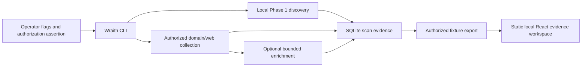

# Wraith Architecture Audit

**Audit status:** Baseline assessment of the repository as of the Phase 1–6 implementation. This document describes **what is implemented today** and a modular evolution path; it does not claim that proposed subsystems already exist.

## Executive architecture summary

Wraith is currently a **local-first Go CLI with an embedded SQLite evidence store and a static React fixture viewer**. Its implemented focus is bounded, operator-authorized reconnaissance evidence rather than a hosted multi-user platform. The current architecture has a useful separation between local discovery, web collection, parsing, persistence, optional subprocess wrappers, and presentation. It does not currently provide a REST API, authentication, tenant isolation, scheduler, queue, worker fleet, remote dashboard backend, PostgreSQL, Redis, plugins, cloud connectors, reporting service, or an AI subsystem.

| Layer | Current implementation | Important boundary |
| --- | --- | --- |
| CLI | `discover`, `scan`, `history`, `export-fixtures`, and `version` dispatch through `internal/cli`. | Active workflows require operator-supplied authorization flags; no remote API command surface exists. |
| Local discovery | Linux-first interface/CIDR validation, bounded ARP candidates, curated TCP checks, and limited metadata. | Phase 1 rejects public CIDRs and requires an explicit selected local IPv4 boundary. |
| Domain/web collection | Certificate-transparency/DNS enumeration, bounded HTTP probing, content discovery, and JavaScript analysis. | Existing policy requires an explicitly authorized domain/origin and treats output-derived targets as untrusted. |
| Optional enrichment | Nmap and Nuclei wrappers. | Both are opt-in, optional external binaries; they do not become enabled by discovery output. |
| Persistence | SQLite through `modernc.org/sqlite`, embedded SQL migrations, and per-scan findings. | Single-user local storage; no encrypted-at-rest, remote, or tenant-aware data service. |
| History | Pure in-memory NEW/REMOVED/CHANGED diff functions over persisted scan snapshots. | Current finding-level diffs are presence-oriented and are not an asset graph or risk engine. |
| Dashboard | Static React/Vite application reading local JSON fixtures. | Read-only, fixture-backed, no backend, network polling, authentication, or write actions. |
| Quality/release | SHA-pinned GitHub Actions, Go/frontend tests, static analysis, dependency review, reproducible build metadata, and checksums. | Artifacts are checksummed, not signed or provenance-attested. |

## Current repository map

```text
cmd/wraith
  └── process entry point

internal/
  ├── cli                command parsing, orchestration, terminal/JSON contracts
  ├── config             local IPv4 scope validation and limits
  ├── discovery          Linux ARP/interface behavior
  ├── ports, probe       bounded TCP and HTTP probing
  ├── enum               certificate/DNS and optional VirusTotal enumeration
  ├── contentdiscovery   bounded path discovery
  ├── jsanalysis         same-origin JavaScript analysis and redaction-aware findings
  ├── portscan           optional Nmap adapter
  ├── vulncheck          optional Nuclei adapter
  ├── storage            SQLite migrations, persistence, and snapshot diffs
  ├── metadata, model, output, executil, buildinfo
  └── testutil           test-support package boundary (currently no Go source)

web/
  └── Vite/React fixture dashboard with snapshot/history views

docs/, README.md, SECURITY.md
  └── scope, responsible use, Phase implementation records, release, support, and threat documentation
```

The current database schema has three embedded migrations and first-class tables for scans, devices, subdomains, content findings, JavaScript findings, port findings, and Nuclei findings. This is a solid evidence ledger for the implemented CLI, but it is not yet a unified asset model.

## Current control flow



The diagram is deliberately local and operator-mediated. No current path starts a recurring job, exposes a listening API, sends notifications, or uses a queue.

## Strengths to retain

The full-spectrum roadmap should preserve the following architecture decisions rather than rewrite them away.

| Strength | Evidence in the current repository | Preservation rule |
| --- | --- | --- |
| Narrow phase boundaries | Phase scope, responsible-use policy, and explicit non-guarantees are documented alongside implementation. | Every new active capability needs a separate scope, policy, test, and threat-model update. |
| Bounded work | Existing options use timeouts, concurrency, rate, response-size, and target limits. | Every future provider and job must have explicit budgets, cancellation, and observable partial-failure states. |
| Evidence over certainty | Source errors, `potential` secret confidence, stale fixtures, and “none observed” states remain visible. | Future findings, correlations, and recommendations must distinguish observed evidence, inference, and operator decision. |
| Local data control | SQLite and fixtures are local by default. | Any remote service needs retention, encryption, access-control, deletion, and audit decisions before it is enabled. |
| Optional external tools | Nmap/Nuclei are explicit flags and fail non-fatally when absent. | Future plugins/providers must declare capability, scope requirements, resource limits, data flow, and failure behavior. |
| Testable boundaries | Pure diffs, fixture-driven parsers, static dashboard tests, and CI gates are already present. | New orchestration must be designed as small testable interfaces, not a monolithic scan pipeline. |

## Target architecture: modular monolith first

The supplied vision calls for API services, worker fleets, cloud integrations, plugin SDKs, risk analysis, and continuous monitoring. Those should **not** be introduced as a distributed system in one step. The recommended transition is a modular monolith with explicit interfaces and an embedded/local implementation first. Remote API, queue, PostgreSQL, Redis, and worker deployment become later replacements behind stable contracts.

```text
Wraith application boundary
├── Command/API adapters
│   ├── CLI (current)
│   └── HTTP API (future; after auth and object authorization)
├── Policy services
│   ├── authorization assertion and record
│   ├── project scope evaluator
│   ├── target/redirect/DNS validation gateway
│   └── resource-budget policy
├── Evidence services
│   ├── asset identity and normalization
│   ├── observations and provenance
│   ├── findings and confidence
│   └── history/diff
├── Collection services
│   ├── local network, DNS, HTTP, TLS, content, JavaScript
│   └── explicitly approved optional-tool adapters
├── Execution services
│   ├── synchronous local run (first)
│   ├── job abstraction (later)
│   └── queue/worker adapter (only when operationally required)
├── Persistence ports
│   ├── SQLite local adapter (current evolution path)
│   └── PostgreSQL adapter (future production decision)
└── Presentation adapters
    ├── JSON/terminal output (current)
    ├── static fixture UI (current)
    └── authenticated web UI/API clients (future)
```

### Required boundary contracts before platform expansion

| Contract | Why it is needed | Must be true before an implementation is enabled |
| --- | --- | --- |
| `ScopeEvaluator` | Replaces scalar authorization flags with evaluated project/domain/CIDR/URL/port policy. | Deny-overrides-allow behavior, redirect/DNS/IP validation, decision trace, and exhaustive tests exist. |
| `TargetGateway` | Centralizes every outbound network request. | URL parsing, DNS rebinding defense, private/reserved-address policy, redirect revalidation, rate limits, and budgets are enforced in one path. |
| `Observation` | Normalizes raw collection facts without converting them into conclusions. | Every observation includes stable subject identity, source, observed time, run ID, evidence payload bounds, and retention classification. |
| `Finding` | Represents an analyst-visible conclusion separately from raw observation. | Severity, confidence, rule/source version, evidence reference, and lifecycle semantics are explicit; version strings alone cannot become confirmed vulnerabilities. |
| `Job` | Makes later scheduling/worker execution cancellable and auditable. | Immutable scope snapshot, authorization record, resource budget, requester identity, status, cancellation, and idempotency contract exist. |
| `AuditEvent` | Makes project, scope, job, and data access actions reviewable. | Events are append-oriented, tenant/project-scoped, minimally sensitive, and protected from ordinary user mutation. |

## Data-model evolution

The next data model should add normalized, project-scoped entities while preserving the existing scan ledger as importable historical evidence.

| Needed entity | Intended role | Not implemented today |
| --- | --- | --- |
| Organization and project | Ownership, data-isolation, and authorization boundary. | Yes |
| Scope rule and scope version | Allow/deny policy with immutable evaluation context. | Yes |
| Asset and asset identity | Deduplicated Domain, Subdomain, IP, Host, URL, Port, Service, Certificate, Technology, and Application records. | Yes |
| Asset observation | Time-bounded source record linked to an asset and run. | Partially represented only as scan-specific rows. |
| Finding and finding observation | Evidence-backed security-relevant record with confidence and lifecycle. | Current Nuclei rows are observations, not a general finding lifecycle. |
| Job and run | Execution contract, progress, cancellation, budget, and audit link. | Yes |
| User, API principal, role | Authenticated actions and object-level authorization. | Yes |

## Explicitly deferred architecture

The following should remain deferred until the preceding contracts and a separate scope review are complete: distributed workers; cloud credential connectors; active-directory inventory; multi-tenant hosting; job scheduling; WebSocket events; plugins that execute code or external tools; AI-assisted analysis; risk scores; attack-path computation; automated notifications; PDF/report delivery; and live remote dashboards.

## Audit evidence

This document is based on the current package inventory, command dispatcher, scope validation, SQLite layer, migrations, dashboard, CI workflow, responsible-use policy, and existing repository threat model. Relevant implementation entry points include `internal/cli/phase2_run.go`, `internal/config/scope.go`, `internal/storage/db.go`, `internal/storage/diff.go`, `web/src/components/Dashboard.tsx`, and `.github/workflows/ci.yml`.
