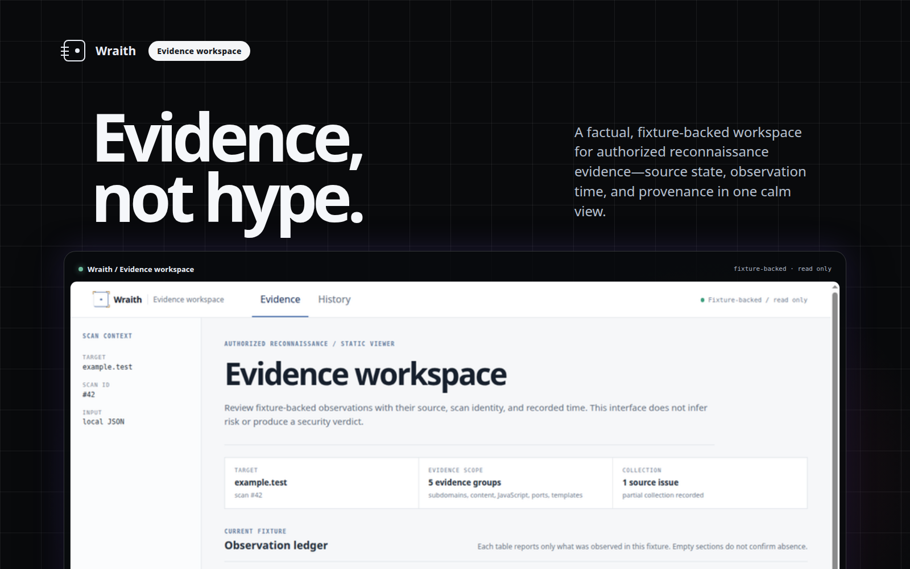
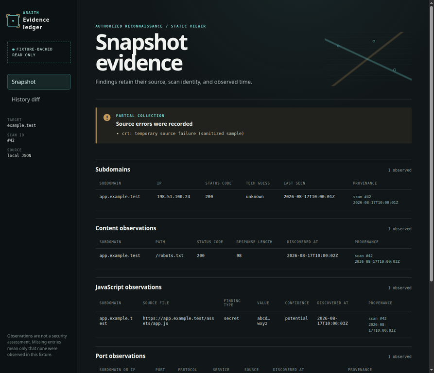

# Wraith

[](https://github.com/Adam-Ghanem/Wraith/actions/workflows/ci.yml)
[](LICENSE)

**Wraith is a phased, safety-first Go toolkit for authorized attack-surface discovery and evidence review.** It favors bounded collection, provenance, and explicit non-guarantees over broad, unverifiable scanning.

Most reconnaissance tools optimize for reach. Wraith is intentionally narrow: each phase makes its target boundary, authorization gate, limits, evidence model, and exclusions visible. The result is an inspectable local-network and web-reconnaissance workflow—not an exploitation framework or a claim that observed output is a security verdict.

## Product preview



> The framed workspace is a real render of the bundled, sanitized Phase 5 fixtures. The surrounding grid and product frame are presentation only; they do not imply a live service, risk calculation, or validated security finding.

> **Legal Notice — `--authorized` is a self-attestation only.** This flag is a checkbox supplied by the operator, not technical verification. Wraith does not verify domain ownership, WHOIS records, or authorization in any way. You are 100% legally responsible for confirming real authorization—through ownership, written permission, or an in-scope bug bounty program—before running any scan against a target. Misuse against unauthorized targets may be illegal in your jurisdiction.

## Table of contents

- [At a glance](#at-a-glance)
- [Product preview](#product-preview)
- [Quick start: inspect real sample output without scanning](#quick-start-inspect-real-sample-output-without-scanning)
- [Visual proof: Phase 5 fixture dashboard](#visual-proof-phase-5-fixture-dashboard)
- [Phase details](#phase-details)
- [Build and test](#build-and-test)
- [Safe testing](#safe-testing)
- [Project documents](#project-documents)

## At a glance

| Phase | Status | What it provides | Important boundary |
| --- | --- | --- | --- |
| 1 | Implemented | Linux-first local IPv4 discovery, bounded ARP candidates, curated TCP connect checks, and read-only metadata | Explicit interface/CIDR only; local-network scope; no public-target discovery |
| 2–3 + R3 transport | Implemented on feature branch | Authorized domain reconnaissance, bounded probing, persistence/diffs, content discovery, JavaScript analysis, and project-scoped HTTP transport | Every target-web `scan` requires `--authorized --project`; R1 authorizes every migrated HTTP target/resolved address and potential secrets remain redacted |
| 4 | Implemented | Optional Nmap and Nuclei enrichment wrappers | Opt-in only; same-scan targets only; no arbitrary target injection, exploitation, fuzzing, or DAST modes |
| 5 | Implemented | Static, read-only evidence dashboard backed by local JSON fixtures | No backend, live database connection, network polling, authentication, or write actions |
| 6 | Implemented | Blocking CI, reproducible build metadata, checksums, dependency review, MIT licensing, disclosure, threat model, and support guidance | Release artifacts are checksummed, **not signed** |
| R7 | Implemented on feature branch | Explicit bounded parameter/request fuzzing with R1/R3-only execution and redacted response evidence | Safe-method default; explicit target/parameter selection; no findings, credentials, or exploitation |
| R7.5 | Implemented on feature branch | Bounded local-wordlist path and virtual-host discovery with soft-404 filtering | Explicit project-local base evidence, `--authorized`, R1/R3-only requests, hard budgets, redacted observations; no crawler expansion or validation |
| R8 | In progress on feature branch | Evidence-led passive checks for security headers, CORS, cookies, error disclosure, and information disclosure | Explicit project endpoint, one bounded R1/R3 request, redacted validation observations; no payloads, credential testing, or exploitation |
| R9 | Implemented on feature branch | Local asset graph, evidence-only correlation, explainable confidence, and snapshot change detection | Project-scoped SQLite structures and `wraith intelligence`; no network I/O, remote advisory feed, graph service, severity invention, or exploit claims |
| R10 | Implemented on feature branch | Project identities, bounded auth-test, and differential comparison | Explicit dual gate, local bounded sources, R1/R3-only live requests, secret-free persistence, and protection stops |
| R10.5 | Implemented on feature branch | `wraith pentest` plans and coordinates existing approved modules, project-scoped run history, safe resume, and local reports | Reuses existing R1/R3-controlled paths only; one global budget/rate/concurrency limit; `auth_attack` requires `--attack-auth` and is not replayed during resume |
| R11.1 | Implemented on feature branch | Deterministic, project-scoped request-variant planning for existing R2 endpoint and parameter identities | No network execution, R1/R3 bypass, secret/header persistence, findings, or validation; R11.2 and later are unstarted |
| R11.2 | Implemented on feature branch | Project-scoped candidate discovery from R5/R2 inventory, local R6 references, and explicit safe wordlists | Passive/dry-run discovery is no-network; optional `--verify` uses only non-destructive R3 `HEAD` calls under R10.5 budget/rate/concurrency controls and stores redacted R2 response metadata |
| R11.3 | Implemented on feature branch | Bounded, evidence-driven injection test planning and explicit R3-only execution seam | Immutable safe canaries, GET/HEAD only, R10.5 budget/rate/concurrency controls, redacted R2 signals, R8 validation handoff, no direct findings, and no CLI active execution |
| R11.4 | Implemented on feature branch | Project-scoped controlled reproduction of R11.3 signals into R8-backed evidence and R9-ready finding candidates | Required R1 recheck before every injected-R3 request; GET/HEAD only; R10.5 controls; `429` and generic infrastructure instability are inconclusive; payloads remain memory-only; no final finding, scheduler, or CLI active execution |

## Quick start: inspect real sample output without scanning

Wraith does not offer a zero-configuration scanner demo: Phase 1 needs a real selected local interface/CIDR, and web reconnaissance requires a domain that you own or are explicitly authorized to test. The safe no-target route is the Phase 5 dashboard, which reads the repository’s bundled sanitized fixtures and makes **no network request for scanning**.

```bash
git clone https://github.com/Adam-Ghanem/Wraith.git
cd Wraith/web
pnpm install --frozen-lockfile
pnpm dev
```

Open the local URL printed by Vite. The dashboard renders `web/public/fixtures/scan.json` and `web/public/fixtures/history.json`; it is a read-only evidence viewer, not a security assessment. The supported local-development versions are documented in the [support matrix](docs/support-matrix.md).

## Visual proof: Phase 5 fixture dashboard

The product preview above presents the actual dashboard inside a static showcase frame. The direct render below is captured from the local Phase 5 application using its bundled sanitized fixtures. It shows the white, provenance-aware workspace with its recorded source failure and redacted potential-secret display.



The screenshot demonstrates the interface only. Its rows are sample observations, and missing entries mean only that none were observed in that fixture.

## Phase details

<details>
<summary><strong>Phase 1 — Linux-first local-network discovery</strong></summary>

Phase 1 is a standalone CLI for authorized local IPv4 inventory. It remains intentionally local-only; it is not an internet scanner, vulnerability scanner, exploitation framework, or web-reconnaissance platform.

The implementation provides explicit local IPv4 interface and CIDR selection; explicit operator confirmation that targets are owned or authorized; bounded ARP candidate discovery on the selected local CIDR; TCP connect checks against the versioned curated top-100 TCP port list; bounded, read-only service metadata capture; JSON and terminal output; and fail-closed validation for scope, authorization, limits, and port-list changes.

The Linux ARP adapter may require raw or packet-socket privileges. If packet access is denied, Wraith returns an operator-readable error identifying a possible `CAP_NET_RAW`/`CAP_NET_ADMIN` or controlled elevated-execution requirement; it does not silently fall back to another scanner. Prefer the least-privilege capability or controlled elevated execution required by the host configuration.

```bash
./bin/wraith discover \
  --interface eth0 \
  --cidr 192.168.1.0/24 \
  --authorized \
  --format terminal
```

For JSON output, use `--format json` or the compatible `--json` alias. Use `-v` for structured diagnostic messages on stderr. If the selected CIDR contains more than 256 candidate hosts, Wraith requires `--confirm-large-subnet`; the candidate count remains bounded by `--arp-max-targets`.

</details>

<details>
<summary><strong>Phase 2–3 — authorized web reconnaissance, content discovery, and JavaScript analysis</strong></summary>

Phase 2 and Phase 3 provide a bounded workflow for domains that the operator owns or is explicitly authorized to test. Every `scan` requires `--authorized --project PROJECT` and an active R1 scope in the selected SQLite database; `history` remains a local read-only command with `--authorized`. Wraith does not technically verify ownership or permission. Migrated target-web activity is bounded by timeout, concurrency, rate, response-size, redirect, retry, TLS, destination, and persistence controls.

| Capability | Boundary |
| --- | --- |
| Subdomain enumeration | crt.sh passive certificate discovery, optional VirusTotal enrichment when `VT_API_KEY` is configured, and bounded DNS enumeration. |
| HTTP/HTTPS probing | Bounded requests with same-host redirect limits, response-size caps, technology guesses, and read-only metadata. |
| Content discovery | A curated path list with a random soft-404 baseline; findings are limited to meaningful 200, 301, 302, and baseline-different 403 observations. |
| JavaScript analysis | Same-host script extraction and bounded file analysis for API-like endpoints and redacted potential-secret pattern matches. |
| Storage and diffing | Versioned SQLite migrations, transactional scan persistence, and pure NEW/REMOVED/CHANGED history diffs. |
| Explicit exclusions | No subdomain port scanning, cross-finding vulnerability correlation, REST API, PDF/CSV export, scheduling, or multi-tenancy. |

Run an authorized scan and retain it locally:

```bash
./bin/wraith scan -d example.com --project project-a --authorized --db wraith.db
./bin/wraith scan -d example.com --project project-a --authorized --json --db wraith.db > scan.json
./bin/wraith history -d example.com --authorized --db wraith.db
```

The default database is `wraith.db` in the current directory. VirusTotal is optional and is used only when `VT_API_KEY` is present; if absent, Wraith logs that the source was skipped and continues with crt.sh and bounded DNS enumeration. A source failure does not abort the complete scan.

Content discovery and JavaScript analysis run by default after Phase 2 HTTP probing. Disable them independently with `--skip-content-discovery` or `--skip-js-analysis`.

```bash
./bin/wraith scan -d example.com --project project-a --authorized --db wraith.db --skip-content-discovery
./bin/wraith scan -d example.com --project project-a --authorized --db wraith.db --skip-js-analysis
```

Potential-secret findings are pattern matches only. They are always labeled `potential`, shown in redacted form, and never validated, used, or exfiltrated. A finding may be a false positive; handle any suspected credential through an authorized incident-response process without giving Wraith the value.

</details>

<details>
<summary><strong>R7.5 — bounded content and virtual-host discovery</strong></summary>

`wraith content` and `wraith vhost` are separate, explicitly authorized wordlist-driven workflows. They require an R2-observed base URL in the selected project and a local wordlist; they never download lists or create an alternate HTTP/DNS/socket path. A path run performs a bounded soft-404 baseline and candidate checks. A virtual-host run keeps the transport base URL fixed while applying a validated Host override; each candidate hostname receives an R1 authorization decision before resolution or connection.

Use `--dry-run` to validate the plan first. `content --depth` defaults to `0` and is capped at `2`; it derives only wordlist-based children below meaningful HTML paths and never follows links, robots, or sitemaps. See [`docs/content-discovery.md`](docs/content-discovery.md) for exact commands and exclusions.

</details>

<details>
<summary><strong>R8 — evidence-led passive validation</strong></summary>

`wraith validate` selects one existing endpoint from the named project and, unless `--dry-run` is supplied, refreshes it once through the same R1/R3 transport used by the other target-web modules. The current validator set only examines bounded response evidence for missing HSTS, unsafe wildcard-credential CORS metadata, missing cookie attributes, bounded stack/error indicators, and versioned server banners. It writes redacted validation observations, not exploit claims. See [`docs/r8-security-validation-spec.md`](docs/r8-security-validation-spec.md) for the exact contract and exclusions.

</details>

<details>
<summary><strong>Phase 4 — optional Nmap and Nuclei enrichment</strong></summary>

Phase 4 adds two opt-in enrichment wrappers for an authorized `wraith scan`. Both flags are off by default and require the existing `--authorized --project` scan gate. Wraith passes only targets discovered and probed during the same scan; it does not accept arbitrary Nmap or Nuclei target injection.

```bash
./bin/wraith scan -d example.com --project project-a --authorized --use-nmap --db wraith.db
./bin/wraith scan -d example.com --project project-a --authorized --use-nuclei --json --db wraith.db > scan-with-vulns.json
./bin/wraith scan -d example.com --project project-a --authorized --use-nmap --use-nuclei --db wraith.db
```

When installed, Nmap uses the conservative TCP-connect profile `-sT -n -Pn -T3 --top-ports 1000 --max-retries 2 --open -oX -`. Wraith deliberately does not enable `-A`, OS detection, service-version detection, NSE scripts, UDP scanning, or aggressive timing. Each discovered IP target has a five-minute context timeout, and XML output is parsed with a bounded output limit.

When installed, Nuclei runs only against live HTTP(S) hosts selected by Wraith’s same-scan web probing. The wrapper selects the `cves,exposures,misconfiguration` template tags, applies a five-request-per-second built-in rate limit, emits JSONL without raw request/response bodies, disables redirects and interactsh, and blocks local/private network access. Fuzzing, DAST, code, headless, AI, and other intrusive modes are not enabled. Each scan has a ten-minute context timeout.

Nmap and Nuclei are optional external dependencies. If either binary is absent, the corresponding enrichment is skipped with a diagnostic message and the scan continues. Port findings record their observed source and read-only service evidence. Nuclei findings preserve template-reported severity and include the template ID, matched URL, and description. Wraith reports these observations only; it never validates, exploits, follows up on, or invents severity for a vulnerability finding.

</details>

<details>
<summary><strong>Phase 5 — static fixture dashboard</strong></summary>

Phase 5 adds a local, read-only React dashboard under [`web/`](web/). It reads static `scan.json` and `history.json` fixtures only; it does not use a backend server, REST API, live SQLite connection, network polling, authentication, sessions, or write actions. The dashboard preserves original evidence state: per-row scan ID and observation time, source failures, explicit “none observed” text for empty finding types, and distinct `NEW`, `REMOVED`, and `CHANGED` history groups. It does not calculate risk scores, aggregate severity, or render scanner-derived values as HTML.

Generate your own fixtures from the existing authorized scan and history paths:

```bash
./bin/wraith export-fixtures \
  -d example.com \
  --db wraith.db \
  --out web/public/fixtures \
  --authorized
```

The export writes `scan.json` first. If fewer than two completed scans exist, it leaves `scan.json` in place, does not retain `history.json`, prints an explanatory note to stderr, and returns the existing history error. The repository includes sanitized sample fixtures for local interface testing. Replace them only through the authorized export command or with your own appropriately redacted fixture copies.

</details>

<details>
<summary><strong>Phase 6 — hardening, CI, and packaging</strong></summary>

The repository runs a blocking [CI workflow](.github/workflows/ci.yml) on pull requests to `main` and pushes to `main`. The Go job verifies module checksums and formatting, runs `go vet`, unit tests, race-detector tests, `golangci-lint`, and `go build`. The web job installs the locked dependency graph, checks TypeScript, runs frontend tests, builds the static dashboard, audits production dependencies, and verifies dependency-review coverage.

Build release artifacts with `make release`; the target uses `-trimpath` and embeds version, commit, and date build metadata. Run `make sha256sums` to generate `SHA256SUMS` for release artifacts. Artifacts are checksummed, **not signed**; the release process does not claim signing or provenance attestation. See the [release process](docs/release-process.md) for exact commands and publication limitations.

The [dependency and license review](docs/dependency-review.md) covers the active Go and pnpm graphs and is checked in CI. Wraith is released under the [MIT License](LICENSE). Security issues have a [responsible-disclosure process](SECURITY.md), while the [threat model](docs/threat-model.md) and [support matrix](docs/support-matrix.md) describe the current trust boundaries, supported environment, capability requirements, and non-guarantees.

</details>

## Build and test

```bash
go test ./...
go build -o ./bin/wraith ./cmd/wraith
```

The repository is Linux-first. The ARP adapter uses the focused [`mdlayher/arp`](https://github.com/mdlayher/arp) package behind an internal interface. A typed Go adapter is preferred over shelling out to `arp-scan`: it avoids executable lookup and command parsing, keeps deadlines and scope checks inside the process, and makes permission failures explicit. The remaining scope and output logic stays separate from packet access so it can be tested without network traffic.

## Safe testing

Use an isolated lab network, Linux network namespaces, disposable virtual machines, or devices that you own and are authorized to test. Begin with unit tests and interface inspection. Then verify ARP and TCP behavior against a small lab CIDR containing a known listener and a closed port. Confirm the selected interface and CIDR before each run, and stop if the result is incomplete or scope is ambiguous.

Do not use random public hosts, shared networks, employer networks, bug-bounty targets, or `scanme.nmap.org` for Phase 1. Public test hosts cannot override the local-only Phase 1 policy.

## Project documents

- [`docs/phase-1-scope.md`](docs/phase-1-scope.md) — frozen Phase 1 boundary and acceptance criteria.
- [`docs/responsible-use.md`](docs/responsible-use.md) — ownership, authorization, prohibited use, and operator duties.
- [`docs/project-plan.md`](docs/project-plan.md) — skill gaps, resources, AI-assistance guidance, Phase 1 build order, and future roadmap.
- [`docs/phase-1-prompt-reconciliation.md`](docs/phase-1-prompt-reconciliation.md) — reconciliation of the attached build prompt with the frozen Phase 1 boundary.
- [`docs/phase-2-implementation.md`](docs/phase-2-implementation.md) — Phase 2 architecture, migrations, limits, and authorized testing instructions.
- [`docs/phase-2-premerge-review.md`](docs/phase-2-premerge-review.md) — Phase 2 pre-merge review findings, decisions, and verification notes.
- [`docs/phase-3-implementation.md`](docs/phase-3-implementation.md) — Phase 3 content-discovery and JavaScript-analysis boundaries, limits, and testing notes.
- [`docs/content-discovery.md`](docs/content-discovery.md) — R7.5 bounded local-wordlist path and virtual-host discovery commands, controls, and exclusions.
- [`docs/r8-security-validation-spec.md`](docs/r8-security-validation-spec.md) — R8 passive validation contract, lifecycle vocabulary, R1/R3 boundary, and exclusions.
- [`docs/r11/r11.3-injection.md`](docs/r11/r11.3-injection.md) — R11.3 bounded injection planner, R3-only active runner seam, redacted evidence signals, and R8/R9 handoff boundary.
- [`docs/r11/r11.4-validation.md`](docs/r11/r11.4-validation.md) — R11.4 controlled reproduction, repeatability, R8 evidence, R9 handoff, and explicit exclusions.
- [`docs/phase-2-3-real-target-verification.md`](docs/phase-2-3-real-target-verification.md) — redacted record of authorized Phase 2+3 live verification and its limitations.
- [`docs/phase-5-implementation.md`](docs/phase-5-implementation.md) — static fixture dashboard, export command, hard exclusions, and Phase 5 testing limitations.
- [`docs/dependency-review.md`](docs/dependency-review.md) — reviewed Go and pnpm dependency inventory, license evidence, exceptions, and CI update control.
- [`docs/release-process.md`](docs/release-process.md) — reproducible build commands, checksum process, and unsigned-release limitations.
- [`SECURITY.md`](SECURITY.md) — security issue scope, responsible-disclosure route, and handling expectations.
- [`docs/threat-model.md`](docs/threat-model.md) — current trust boundaries, assets, assumptions, and mitigations.
- [`docs/support-matrix.md`](docs/support-matrix.md) — supported platforms, prerequisites, privileges, and behavior when capabilities are missing.
